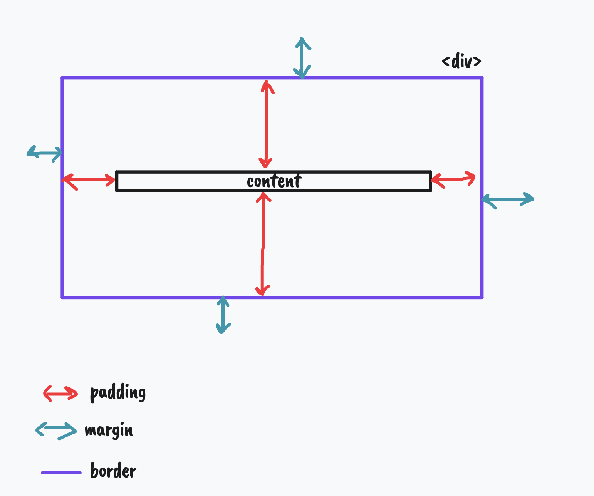

# Notes de developpeur

## Balises HTML

`` : la balise pour les images

`
` : la balise pour les paragraphes

`
` : la balise NEUTRE pour s'en servir comme structure

`<button>` : la balise pour un bouton

`<a>` : pour les liens

`<h1>` : pour les titres

`<section>` : pour les sections de notre

`<ul>` : les liste de choses

`<li>` : chaque élement d'un liste

## Attributs des balises HTML

`` : l'adresse de l'image

`
` : le style CSS de la balise

`<a target="_blank">` : pour ouvrir le lien dans un nouvel onglet

## Lier le CSS avec le HTML

Dans la balise head du HTML :

`<link rel="stylesheet" href="assets/css/style.css">`

## CSS 

- `background-image` : pour l'url d'une image
- `background-size` : pour le placement de l'image de fond
- `background-position` : pour le placement de l'image de fond

Certaines propriétés CSS sont hérités : 
- ex: `font-family` : si on met une font-family spéciale au `body`, alors tous les enfants de `body` auront la même police que le `body` !
- ex : `color` est une propriété qui s'hérite

Selecteur spécifique : 
- plutôt que de rajouter une classe supplémentaire, on cible un élément par son chemin dans la page. Exemple : `.social-link i` cible les `i` qui sont dans un élement avec la classe `social-link` 

## Box model

- `height` : hauteur
- `width` : largeur de la boite

## Documentation 

MDN : Pour le HTML, CSS et JS. Une des meilleures ! 

## Git

## Raccourci 

`CTLR + SHIFT + :` ==> créer des commentaires dans VSCode

## Commandes terminales

Quand on ouvre un terminal, on est par défaut dans un DOSSIER

- `pwd` : print working direction (voir le dossier courant)
- `ls` (mac) / `dir` (window): lister les fichiers et dossier dans le dossier courant

## Fonction

Une suite regroupée d'instructions. 