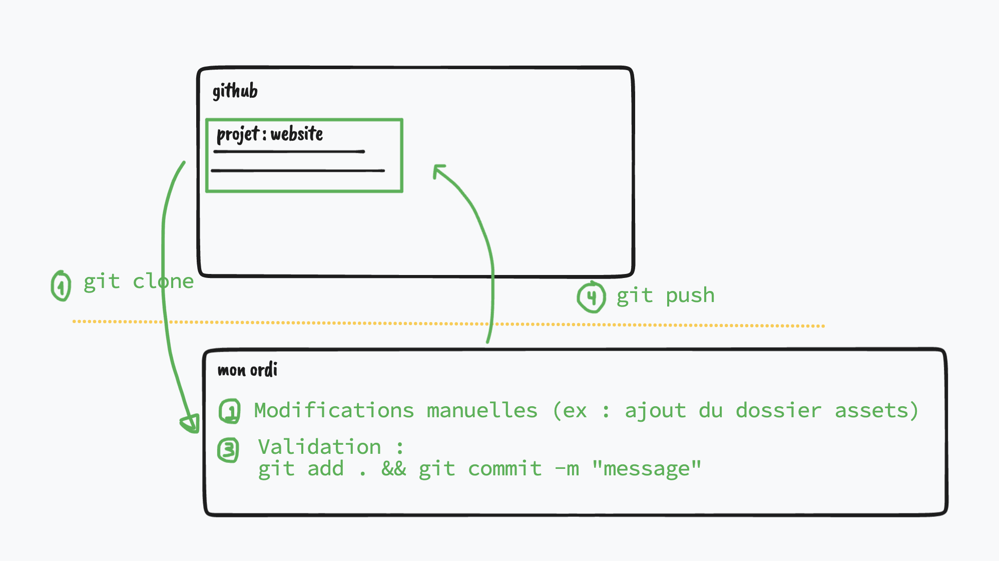
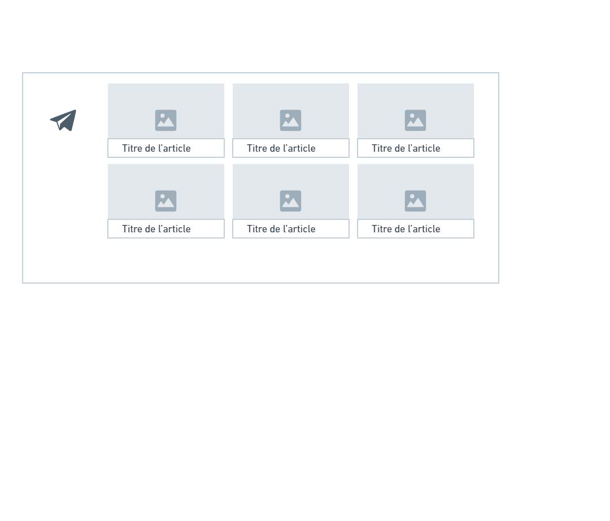

# Les Mamans du Coeur

Ce code a été réalisé par les apprenants du simulateur au POP Café à l’Étoile d’or de Trappes (78).

## Le HTML

### Balises HTML

`` : la balise pour les images

`
` : la balise pour les paragraphes

`
` : la balise NEUTRE pour s'en servir comme structure

`<button>` : la balise pour un bouton

`<a>` : pour les liens

`<h1>` : pour les titres

`<section>` : pour les sections de notre

`<ul>` : les liste de choses

`<li>` : chaque élement d'un liste

### Attributs des balises HTML

`` : l'adresse de l'image

`
` : le style CSS de la balise

`<a target="_blank">` : pour ouvrir le lien dans un nouvel onglet

### Lier le CSS avec le HTML

Dans la balise head du HTML :

`<link rel="stylesheet" href="assets/css/style.css">`

## CSS

- `background-image` : pour l'url d'une image
- `background-size` : pour le placement de l'image de fond
- `background-position` : pour le placement de l'image de fond

Certaines propriétés CSS sont hérités :
- ex: `font-family` : si on met une font-family spéciale au `body`, alors tous les enfants de `body` auront la même police que le `body` !
- ex : `color` est une propriété qui s'hérite

Selecteur spécifique :
- plutôt que de rajouter une classe supplémentaire, on cible un élément par son chemin dans la page. Exemple : `.social-link i` cible les `i` qui sont dans un élement avec la classe `social-link`

### Box model

- `height` : hauteur
- `width` : largeur de la boite

## Documentation

MDN : Pour le HTML, CSS et JS. Une des meilleures !

## Git

## VSCode

### Raccourci

`CTLR + SHIFT + :` ==> créer des commentaires dans VSCode

### Commandes terminales

Quand on ouvre un terminal, on est par défaut dans un DOSSIER

- `pwd` : print working direction (voir le dossier courant)
- `ls` (mac et linux) / `dir` (window): lister les fichiers et dossier dans le dossier courant

## Javascript

### Fonction

Une suite regroupée d'instructions.

## SEO

Le SEO est un ensemble de techniques qui va permettre à un site d'être référencé par un moteur de recherche.

- [SEO.fr](https://www.seo.fr/definition/seo-definition)
- [SEO selon Google](https://developers.google.com/search/docs/fundamentals/seo-starter-guide?hl=fr)

### Metas

- mettre un __titre__ pertinent pour chaque page
- mettre une balise __meta keyword__ avec des mots-clés qui définissent notre page
- mettre une balise __meta description__ avec une description courte de notre page

### HTML Sémantique

- header
- main
- footer (mettre du contenu)
- niveau de titre : h2, h3

- [MDN - HTML sémantique](https://developer.mozilla.org/fr/docs/Glossary/Semantics)

## Responsive Web Design

On peut le mettre en place à partir d'une intégration pour écran d'ordinateur (écran large), ou le mettre à partir d'une intégration pour écran mobile (écran réduit).

Dans notre cas, on a déjà fait l'intégration pour écran d'ordinateur.

:one: __On fixe bien l'intégration pour écran large__

- mettre les marges et les tailles de blocs avec des unités relatives (%, ou rem)
- mettre les images en `max-width:100%`, c'est le conteneur de l'image qu'on va contraindre en taille (avec des unités relatives : %)
- veiller à ce que les `font-size` (hauteur de caractères) soient définies en `rem`

> 1 rem équivaut à 16 pixels dans le cas d'un navigateur où on a pas changé les tailles de caractères.
> si l'utilisateur a besoin d'une taille de caractères plus haute (par exemple au minimum 24pixels), alors 1rem équivaudra à 24px.

- corriger les problèmes de centrages
- réduire la taille des caractères et agrandir les zones d'affichage de texte.

:two: On fait la déclinaison pour tablette puis pour mobile.

## Avenant pour mettre en forme la partie "article de blog"

